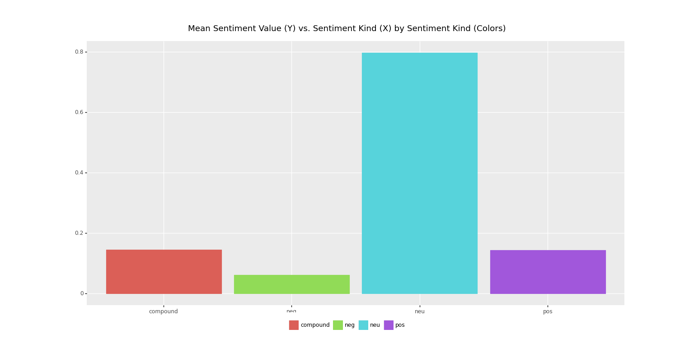

# About Us

Hello and welcome to our final Software Design class project. Our names are Rafael Haber Premisleaner and Maximilian Kern, and we are current students at Babson College with an interest in Data Science. To utilize the learnings from this class and combine it with Data Science, we have decided to create a website that allows a user to query tweets by a certain username that can contain a keyword and also gives the user the ability to query for retweets and replies. We would have liked to also allow a user to specify a specific time period, though we are not unable to do so due to our current Twitter API access level. Please read the instructions below to understand the functionality of our website.

## Instructions for the use of this website

This website uses the Twitter API to retrieve information the user desires. Before discussing the specific use cases of each of the functions of this website, we shall first discuss the usage and limitations of the Twitter API. The Twitter API has multiple parameters available for usage, though in our case we are interested in only a few specific ones: usernames, keywords, date intervals, and max results. In order to query from the whole tweet database, one would need to be granted academic access to the Twitter API -- which is only available to Master's/PhD students. As such, our queries have an important limitation: it can only search for tweets in the previous seven days. Given this constraint, we have chosen to automatically input the last seven days into our query in order to avoid issues, and because allowing users to specify dates conditional on the last seven would be relatively redundant. Alas, the user should input a username(s), keyword (can be left blank), number of results (min: 10, max: 100), and whether he/she wants retweets and/or replies by this user to be included. 

## Find Tweets

This page allows a user to search for tweets by a certain user(name) containing a keyword, and allows a user to specify whether or not they want to include retweets/replies. The following is an example of a query looking for tweets by Elon Musk containing the word 'speech' that can include retweets and replies. If keyword is not specified, then it will just returns all the tweets (including or nor retweets and replies) for a certain time interval.

## Sentiment Analysis

This page returns the mean sentiment value for tweets by a user(name) containing a keyword, and allows a user to specify whether or not they want to include retweets/replies. The following is an example of tweets by pmarca (Marc Andreesseen, famous venture capitalist) containing the word 'speech.' We can notice that he is mostly neutral about it, though he is also more positive than negative.

## Histogram

This page returns a histogram of the five most commonly used words for tweets by a user(name) containing a keyword, and allows a user to specify whether or not they want to include retweets/replies. Following up from our example by Elon Musk, let's look at the five most commonly used words on tweets containing the word 'speech.'

#### Dependencies
All library dependencies can be found below:
- import string
- from nltk.sentiment.vader import SentimentIntensityAnalyzer
- from datetime import datetime, timezone, timedelta
- from asyncio.windows_events import NULL
- from types import NoneType
- from config import bearer_token
- import tweepy
- import pandas
- import plotnine
- from plotnine import *